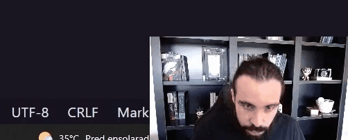

# Projeto com README
Um projeto de teste com um arquivo README ✔😃

[](https://www.google.com)

## Tecnologias utilizadas
- HTML
- CSS
- JS

## Como utilizar

1 - Clone o projeto
```
git clone https://github.com/henrisoares/aula-tabela.git
```
2 - Acesse a pasta do projeto
```
cd aula-tabela
```
